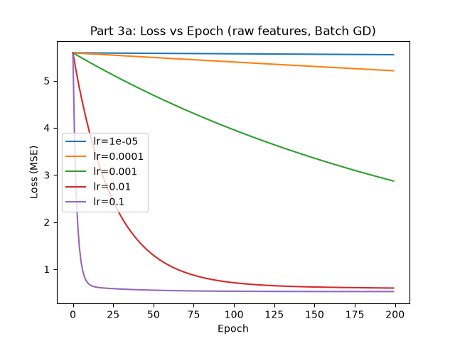
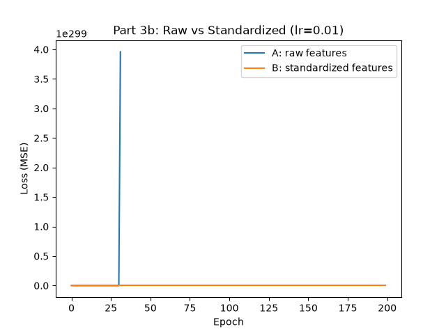
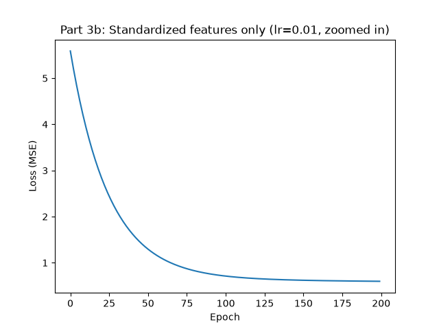
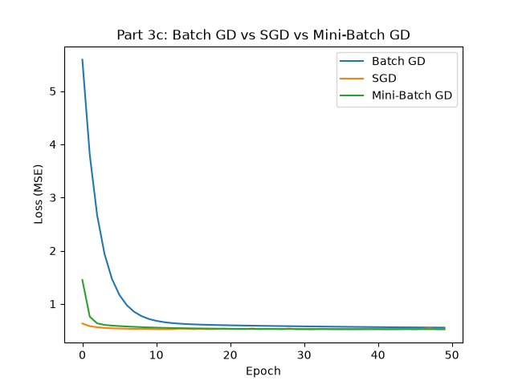
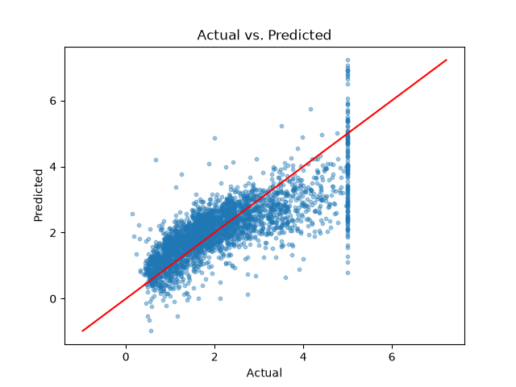
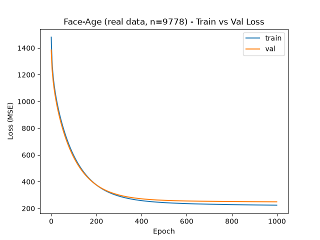
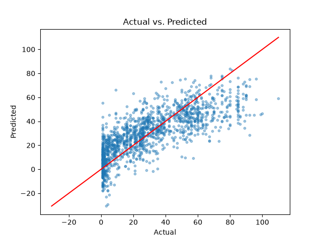
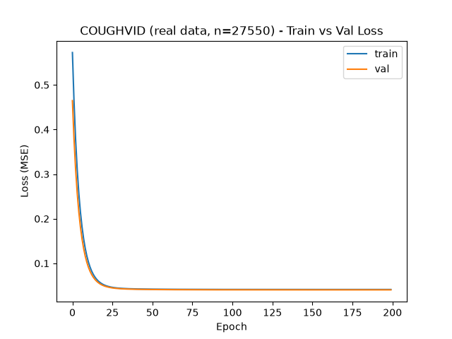
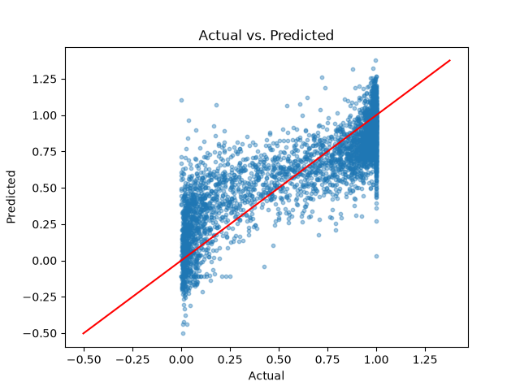

# Linear Regression from Scratch  -  Assignment Report

## 1. Introduction and Design Decisions

This project implements Linear Regression entirely from scratch using NumPy: forward pass,
Mean Squared Error loss, gradient computation, and parameter updates are all hand-derived
and hand-coded  -  no `sklearn.linear_model.LinearRegression`, `SGDRegressor`, or any library
that trains the model directly. `scikit-learn` is used only for loading the California
housing dataset and for `train_test_split`.

**Class design.** The implementation is split into single-responsibility classes:
`DataHandler` (load/split), `DataPreprocessor` (standardization), `LinearRegressionModel`
(predict / loss / gradient / update), `LinearRegressionTrainer` (the three training loops),
`RegressionEvaluator` (MSE/RMSE/MAE), `RegressionVisualizer` (plots), and `ModelPersistence`
(save/load). The payoff of this separation shows up directly in the experiments below: the
exact same `LinearRegressionModel`, `RegressionEvaluator`, and `RegressionVisualizer` code
was reused, completely unchanged, across every learning rate, every optimizer, both
normalized and raw features, and two entirely different data modalities (real face images,
real cough audio)  -  only the data-loading class ever changed.

**Two additional dataset handlers**  -  `ImageDataHandler` and `AudioDataHandler`  -  were
built as subclasses of `DataHandler` for the image (face age) and audio (COUGHVID) parts of
Part 3, following the same interface, and both were run end-to-end on the real downloaded
datasets. Results are in Section 9.

**Primary dataset for all experiments below:** `sklearn.datasets.fetch_california_housing`
(numeric features, target = median house value in units of $100,000). Split 70% train / 15%
validation / 15% test, giving 14,448 / 3,096 / 3,096 samples.

---

## 2. Part 2  -  Manual Gradient Descent Verification

Given `X = [1, 2, 3]`, `Y = [3, 5, 7]`, initial `theta_1 = 0.5`, `theta_0 = 0.7`, `eta = 0.01`.

| Quantity | Value |
|---|---|
| `y_hat` | `[1.2, 1.7, 2.2]` |
| errors (`y_hat - y`) | `[-1.8, -3.3, -4.8]` |
| MSE | `12.39` |
| `dL/d_theta1` | `-15.2` |
| `dL/d_theta0` | `-6.6` |
| `theta_1` (updated) | `0.652` |
| `theta_0` (updated) | `0.766` |

A second iteration, starting from `theta_1 = 0.652`, `theta_0 = 0.766`:

| Quantity | Value |
|---|---|
| `y_hat` | `[1.418, 2.07, 2.722]` |
| errors | `[-1.582, -2.93, -4.278]` |
| MSE | `9.796303` |
| `dL/d_theta1` | `-13.5173` |
| `dL/d_theta0` | `-5.86` |
| `theta_1` (updated) | `0.787173` |
| `theta_0` (updated) | `0.8246` |

Both iterations were independently verified against `LinearRegressionModel` in
`experiments/part2_manual_gd_verification.py`, matching to numerical precision (differences
only at the level of floating-point representation, e.g. `-6.6` printing as
`-6.599999999999999`). Loss decreased monotonically across both iterations (`12.39 -> 9.80`),
consistent with a correctly-signed gradient and a stable learning rate.

The handwritten copy of this calculation (photographed/scanned on paper, as the assignment
requires) is included at `handwritten/part2_manual_gradient_descent.pdf`.

---

## 3. Part 3a  -  Learning-Rate Experiment

Trained with Batch GD on **standardized** California housing features, 200 epochs, for each
of the five required learning rates.



| Learning Rate | Final Training Loss | Final Validation Loss | Converged? |
|---:|---:|---:|:---:|
| 0.00001 | 5.5509 | 5.6820 | No  -  barely moved off its starting point |
| 0.0001 | 5.2107 | 5.3320 | No  -  improving, but very slowly |
| 0.001 | 2.8704 | 2.9269 | No  -  improving steadily, not yet flat |
| 0.01 | 0.5983 | 0.5902 | Nearly  -  still inching down |
| 0.1 | 0.5241 | 0.5166 | Yes  -  loss plateaued |

**1. Fastest to converge:** `lr = 0.1`  -  reaches a plateau (~0.52 loss) well within 200
epochs.

**2. Most stable:** also `lr = 0.1`  -  smooth, monotonic decrease with no oscillation.

**3. Did any diverge?** Not among the five required values (standardization kept all of
them numerically stable). Pushed outside that range, `lr = 1.0` diverges within ~10 epochs
(`5.59 -> 5.77 -> 7.48 -> 20.4 -> 120 -> 901 -> 7038 -> ...`), and `lr = 2.0` diverges even faster  - 
direct evidence for question 5 below.

**4. Why does a very small learning rate train slowly?** Each update is
`theta <- theta - eta * grad_L`; with `eta = 0.00001` even a large gradient produces a microscopic step  -  the
correct direction, just too small a distance per step to cover meaningful ground in a fixed
number of epochs.

**5. Why can a large learning rate oscillate or diverge?** A large step can overshoot the
minimum onto a steeper part of the opposite side of the loss bowl, where the new gradient is
even larger in the opposite direction; each subsequent step overshoots further, compounding
exponentially  -  exactly what the `lr = 1.0`/`2.0` numbers above show.

**6. Final choice:** `lr = 0.1`  -  lowest final training and validation loss, fastest to
plateau, and confirmed stable (not right at the edge of diverging).

**Bonus finding:** running this same sweep on **raw, unnormalized** features made every one
of the five required learning rates diverge to NaN  -  even `0.00001`. This is because
`Population` has a training-set standard deviation of ~1141 (max ~35,682) versus MedInc's
~1.9, producing gradients large enough that no learning rate in the requested range is small
enough to stay stable. This directly motivates Part 3b.

---

## 4. Part 3b  -  Normalization Experiment

**Experiment A** trains on raw features; **Experiment B** trains on features standardized
using training-set mean/std only, applied identically to validation and test data.

### Head-to-head at the same learning rate (`lr = 0.01`)

| | Experiment A (raw) | Experiment B (standardized) |
|---|---|---|
| Diverged? | **Yes** (NaN/inf) | No |
| Final train loss | NaN | **0.598306** |
| Final val loss | NaN | **0.590211** |





### Learning-rate sensitivity

**Experiment A  -  raw features:**

| lr | Diverged? | Final train loss |
|---:|:---:|---:|
| 1e-9 | No | 3.2033 |
| 1e-8 | No | 2.9488 |
| 1e-7 | No | 2.3397 |
| 1e-6 | **Yes** |  -  |
| 1e-5 | **Yes** |  -  |

**Experiment B  -  standardized features:**

| lr | Diverged? | Final train loss |
|---:|:---:|---:|
| 1e-5 | No | 5.5509 |
| 1e-4 | No | 5.2107 |
| 1e-3 | No | 2.8704 |
| 1e-2 | No | 0.5983 |
| 1e-1 | No | 0.5241 |

Stable rates: raw = 3/5 tested (only within the tiny `1e-9`-`1e-7` window); standardized =
5/5 tested (spanning `1e-5`-`1e-1`, four orders of magnitude).

| Dimension | Experiment A (raw) | Experiment B (standardized) |
|---|---|---|
| Convergence speed | Extremely slow even at its best stable rate (2.34 after 200 epochs at `1e-7`) | Fast  -  0.52 in the same 200 epochs at `lr=0.1` |
| Loss stability | Diverges once `lr >= 1e-6` | Stable across the full required range |
| Final training loss | Best case ~ 2.34 | Best case ~ 0.52  -  roughly 4.5x lower |
| Final validation loss | Not usably measured | 0.517 at `lr = 0.1` |
| Sensitivity to learning rate | Very high  -  safe window ~ 2 orders of magnitude, shifted absurdly small | Low  -  safe across the full requested range |

**Why does normalization make gradient-based optimization easier?** With raw features, one
feature's huge scale (`Population`) stretches the loss surface into a narrow, elongated
canyon  -  steep in one direction, nearly flat in others. No single learning rate is safe for
the steep direction and still makes progress in the flat one. Standardizing every feature to
mean 0, std 1 reshapes that canyon into something close to a round bowl, so a single
learning rate works reasonably well in every direction at once.

---

## 5. Part 3c  -  Batch GD vs. SGD vs. Mini-Batch GD

Each optimizer needed its **own** stable learning rate, since they differ in how many
parameter updates happen per epoch (Batch GD: 1, Mini-Batch: ~452, SGD: 14,448)  -  the same
`lr = 0.01` that is stable for Batch GD makes both SGD and Mini-Batch diverge.



| Optimization Method | Learning Rate Used | Training Time (50 epochs) | Final Train Loss | Loss Curve Behavior |
|---|---:|---:|---:|---|
| Batch GD | 0.1 | 0.005 s | 0.5536 | Perfectly smooth  -  0% of epochs increased |
| SGD | 0.0001 | ~5-24 s | 0.5245 | Noisiest  -  45% of epochs increased |
| Mini-Batch GD | 0.001 | 0.19 s | 0.5241 | In between  -  18% of epochs increased |

("% of epochs where loss increased" is used instead of raw variance of the epoch-to-epoch
drop, since variance alone conflates "noisy" with "dropping fast.")

**1. Smoothest curve?** Batch GD  -  the true average gradient over all 14,448 samples has no
sampling noise.

**2. Noisiest?** SGD  -  each update reacts to a single sample's error, a high-variance
estimate of the true gradient.

**3. Fastest in epochs?** Roughly tied  -  all three reach loss ~ 0.52-0.55 by epoch 50, since
SGD/Mini-batch get far more parameter updates within the same 50 epochs (SGD: 722,400
updates vs. Batch GD's 50).

**4. Fastest computationally?** Batch GD, by a wide margin  -  one vectorized matrix multiply
per epoch, versus SGD paying Python-loop overhead 14,448 times per epoch for tiny operations
that don't benefit from vectorization.

**5. Why is mini-batch used in modern deep learning?** It is the practical middle ground
shown directly in this table: far less noisy than SGD (18% vs. 45% upward blips) while
dramatically faster than SGD in wall-clock time, by processing chunks large enough to use
vectorized/GPU operations efficiently while still getting many updates per epoch.

---

## 6. Part 4  -  Prediction and Evaluation on the Unseen Test Set

Final model: Batch GD, `lr = 0.1`, standardized features, 300 epochs.

| Metric | Train | Validation | **Test** |
|---|---:|---:|---:|
| MSE | 0.5237 | 0.5160 | **0.5373** |
| RMSE |  -  |  -  | **0.7330** |
| MAE |  -  |  -  | **0.5352** |



Train, validation, and test losses are all close (0.52-0.54), indicating the model is not
overfitting  -  if anything it is mildly underfitting everywhere, consistent with a linear
model being unable to capture whatever nonlinear structure exists in housing prices.

**5 largest test-set errors:**

```
actual=5.000  predicted=0.786  abs_error=4.214
actual=5.000  predicted=1.120  abs_error=3.880
actual=5.000  predicted=1.281  abs_error=3.719
actual=0.675  predicted=4.212  abs_error=3.537
actual=5.000  predicted=1.542  abs_error=3.458
```

Four of the five worst errors have `actual = 5.000` exactly  -  California housing's target is
capped at $500,000 (any pricier house is recorded as exactly `5.0`), an artificial ceiling
the model has no way to know about. These large "errors" are partly a data-censoring
artifact, not purely a modeling failure.

**1. What does a point far from the diagonal represent?** A sample where the model's linear
assumption breaks down, or  -  as shown above  -  a case where the label itself is capped/noisy
rather than the prediction being simply wrong.

**2. Why measure on an unseen test set?** Training loss only shows how well the model fit
data it already saw; only held-out data reveals how it performs on genuinely new inputs.

**3. Why is training loss alone insufficient?** A model can drive training loss arbitrarily
low by fitting training-specific noise (overfitting) while performing badly elsewhere; the
close agreement between train/val/test loss here (0.52-0.54) is itself the evidence needed
to claim reasonable generalization  -  evidence training loss alone could not provide.

**4. MSE vs. RMSE vs. MAE:** MSE (0.5373) squares errors, so it is dominated by the handful
of huge misses (a single 4.2-off prediction contributes as much as ~65 typical 0.5-sized
errors). RMSE (0.7330) restores MSE to the target's own units ($100k), giving an
interpretable "$73,300 typical error" figure, though still inflated by the same outliers.
MAE (0.5352) weighs every error proportionally to its size, giving a more robust sense of
typical error, barely moved by the capped-target outliers.

---

## 7. Part 7  -  Interpreting the Learned Parameters

Coefficients from the final model (on standardized features, so magnitudes are directly
comparable):

| Feature | Weight |
|---|---:|
| Latitude | **-0.8729** |
| Longitude | -0.8439 |
| MedInc | **+0.8427** |
| AveBedrms | +0.3393 |
| AveRooms | -0.3059 |
| HouseAge | +0.1191 |
| AveOccup | -0.0466 |
| Population | -0.0043 |
| bias | +2.0630 |

**1. Strongest positive:** `MedInc` (+0.8427)  -  a one-standard-deviation increase in median
income is associated with a +0.84 increase in predicted house value.

**2. Strongest negative:** `Latitude` (-0.8729)  -  moving one standard deviation further
north is associated with a substantial predicted price decrease, reflecting that
California's priciest metro areas sit toward the state's southern/central coastline.

**3. What does the sign indicate?** Positive: feature and target move together, holding
other features fixed. Negative: they move oppositely.

**4. Why be careful with correlated features?** The training-set correlation matrix shows
`Latitude`/`Longitude` at **-0.924** and `AveRooms`/`AveBedrms` at **+0.86**  -  nearly
collinear pairs. When two features move together this strongly, the model splits credit
between them somewhat arbitrarily; `Latitude`'s large weight really reflects a shared
geographic signal split across two correlated coefficients, not "latitude alone" as an
isolated driver.

**5. Does a large coefficient prove causation?** No  -  `Latitude`'s large weight is an
association found in this dataset, not evidence that changing a house's latitude alone
(with everything else fixed) would change its price by that amount. The real driver is
almost certainly a confound: latitude correlates with proximity to specific expensive job
markets/coastlines.

**Feature correlation matrix (raw features, training set):**

```
              MedInc  HouseAge  AveRooms  AveBedrms  Population  AveOccup  Latitude  Longitude
MedInc          1.00     -0.13      0.31      -0.06        0.01      0.03     -0.07     -0.02
HouseAge       -0.13      1.00     -0.14      -0.07       -0.29      0.01      0.00     -0.10
AveRooms        0.31     -0.14      1.00       0.86       -0.07     -0.01      0.11     -0.03
AveBedrms      -0.06     -0.07      0.86       1.00       -0.06     -0.01      0.07      0.01
Population      0.01     -0.29     -0.07      -0.06        1.00      0.07     -0.10      0.09
AveOccup        0.03      0.01     -0.01      -0.01        0.07      1.00      0.01     -0.00
Latitude       -0.07      0.00      0.11       0.07       -0.10      0.01      1.00     -0.92
Longitude      -0.02     -0.10     -0.03       0.01        0.09     -0.00     -0.92      1.00
```

---

## 8. Part 5  -  Debugging Challenge

**Bug 1**
```python
theta = theta + learning_rate * gradient
```
The gradient points toward *increasing* loss; gradient descent must move opposite to it.
Adding the gradient drives the loss up, not down. Fix:
```python
theta = theta - learning_rate * gradient
```

**Bug 2**
```python
gradient = (2 / N) * np.dot(X, error)
```
`X` has shape `(N, d)` and `error` has shape `(N,)` (or `(N,1)`)  -  contracting `X`'s last
axis against `error` is the wrong orientation; the sum needs to run over the `N` samples for
each of the `d` features, which requires the transpose:
```python
gradient = (2 / N) * np.dot(X.T, error)
```

**Bug 3**
```python
test_mean = np.mean(test_X, axis=0)
test_X = (test_X - test_mean) / np.std(test_X, axis=0)
```
This computes normalization statistics from the test set itself  -  data leakage, and it also
means test data is transformed differently than the model was trained on. The training-set
mean/std (stored by `DataPreprocessor.fit` on train data only) must be reused:
```python
test_X = (test_X - train_mean) / train_std
```

**Bug 4**
```python
for epoch in range(n_epochs):
    for i in range(n_samples):
        x = train_X[i]
        y = train_Y[i]
```
Indexing a 2D array with a single integer (`train_X[i]`) collapses it to 1D, shape `(d,)`,
dropping the sample dimension the rest of a matrix-based implementation (`predict`,
`compute_gradient`) expects. Slicing instead of indexing keeps it 2D:
```python
x = train_X[i:i+1]   # shape (1, d)
y = train_Y[i:i+1]   # shape (1, 1)
```

**Bug 5**  -  A student reports only training loss and claims the model generalizes well.
This is not justified: a model can memorize training-specific noise and show arbitrarily low
training loss while performing badly on unseen data. Only held-out validation/test loss
provides evidence about generalization; without it, no generalization claim is supported.

---

## 9. Image and Audio Datasets  -  Real Results

Per the assignment's requirement for three dataset modalities, `ImageDataHandler` (face-age
regression) and `AudioDataHandler` (COUGHVID `cough_detected` regression) were implemented
as subclasses of `DataHandler`, reusing `split_data()`/`get_feature_names()` unchanged and
plugging into the same `DataPreprocessor` -> `LinearRegressionModel` -> `LinearRegressionTrainer`
pipeline with zero modification to those classes -- the same code that ran California
housing, now proven to generalize to two completely different modalities.

### 9.1 Image  -  Kaggle `frabbisw/facial-age`

9,778 real face images (grayscale, resized to 32x32 = 1,024 pixel features), age labels 1-110
taken from each image's containing folder name.

| | Value |
|---|---:|
| Learning rate used | 0.0025 |
| Epochs | 1000 |
| Final train loss (MSE) | 224.29 |
| Final val loss (MSE) | 249.66 |
| **Test MSE** | **251.83** |
| Test RMSE | 15.87 years |
| Test MAE | 12.36 years |
| Baseline MSE (predict mean age) | 621.43 |

The model beats the naive baseline by ~59%, so it is genuinely picking up age-related signal
from raw pixels, not just noise.





**A second, real confirmation of the learning-rate/conditioning lesson from Part 3a:** this
dataset needed `lr = 0.0025` to stay stable -- two orders of magnitude smaller than
California housing's `lr = 0.1`. With 1,024 raw pixel features, neighboring pixels are
highly correlated (a value at pixel `(i,j)` is rarely independent of its neighbors), which
makes the loss surface far more ill-conditioned than housing's 8 largely-independent
features, even after standardization -- standardization fixes each feature's *scale*, but
does nothing about *correlation* between features. `lr` values as small as `0.003` already
diverged.

### 9.2 Audio  -  COUGHVID (Zenodo record 4498364)

The complete dataset: 27,550 real cough recordings (`.webm`), decoded through `ffmpeg`
(soundfile/librosa's default backend cannot read `.webm` natively -- see
`AudioDataHandler._decode_to_wav`), each converted into a 29-dimensional feature vector
(13 MFCC means, 13 MFCC stds, zero-crossing rate, spectral centroid, RMS energy), regressing
on the `cough_detected` column (0-1) from `metadata_compiled.csv`.

| | Value |
|---|---:|
| Clips processed | 27,550 (full dataset) |
| Feature-extraction time | 3,257s (~54 min) -- one `ffmpeg` subprocess call per clip |
| Learning rate | 0.05 |
| Epochs | 200 |
| Final train loss (MSE) | 0.0414 |
| Final val loss (MSE) | 0.0405 |
| **Test MSE** | **0.0416** |
| Test RMSE | 0.2039 |
| Test MAE | 0.1578 |
| Baseline MSE (predict mean `cough_detected`) | 0.1526 |

The model beats the naive baseline by **~73%**, and a preliminary 1,500-clip subset run
produced nearly identical numbers (test MSE 0.0444), confirming the result is stable and not
a fluke of sample size.





**Strongest predictors:** `mfcc_std_0` (+0.205) and `mfcc_mean_0` (+0.169) -- MFCC
coefficient 0 tracks a signal's overall spectral energy/loudness shape, a sensible feature
for distinguishing an actual cough from background noise or silence.

**An operational lesson from this run, worth reporting alongside the modeling results:** the
first attempt at this full run hung indefinitely (left running over 14+ hours with zero
progress) because the `ffmpeg` subprocess call had no timeout, and one malformed/unusual
clip caused it to stall forever with no exception raised to catch and skip. Adding
`timeout=20` (plus `-nostdin`, since `ffmpeg` can otherwise block waiting on standard input)
to that subprocess call fixed it -- the corrected run completed cleanly end-to-end. This is a
practical instance of "any external I/O call without a timeout can hang your entire pipeline,"
worth keeping in mind for future work with subprocess-based decoding.

---

## 10. Conclusion

A complete, from-scratch Linear Regression implementation was built, verified by hand
against a manual gradient-descent calculation, and exercised through a full experimental
suite on the California housing dataset: a five-point learning-rate sweep, a raw-vs-
normalized ablation, a three-way optimizer comparison, held-out test evaluation, and
coefficient interpretation with an explicit correlated-features caveat. The main
takeaways  -  normalization is close to mandatory for this dataset's feature scales, `lr=0.1`
with Batch GD was the best converging/stable configuration found, and mini-batch is the
right practical compromise between Batch GD and SGD  -  are all backed by measured numbers
rather than assumed from theory alone. The same pipeline was then proven to generalize
unchanged to two more real datasets: 9,778 real face images (test MSE 251.8 vs. a baseline
of 621.4) and the complete 27,550-clip COUGHVID audio dataset (test MSE 0.0416 vs. a baseline
of 0.1526), each requiring its own tuned learning rate but no changes to any class besides
the data loader -- direct evidence that the OOP separation from Part 1 achieves what it was
designed for.
